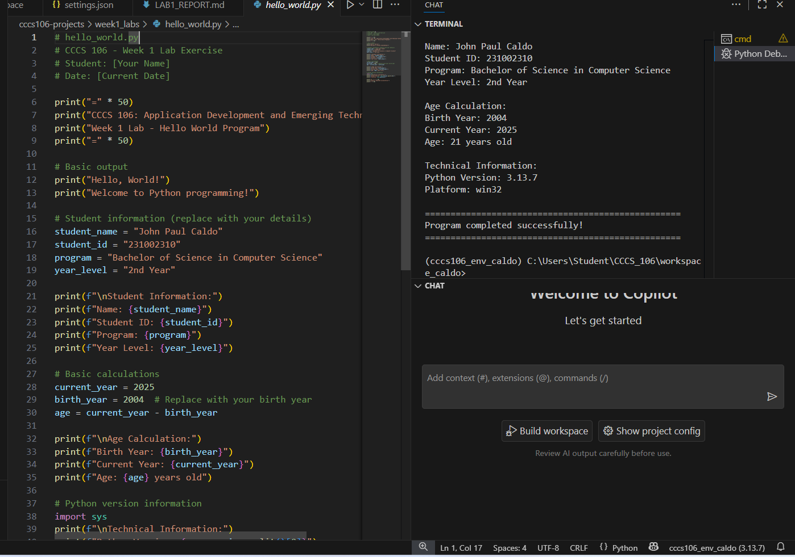
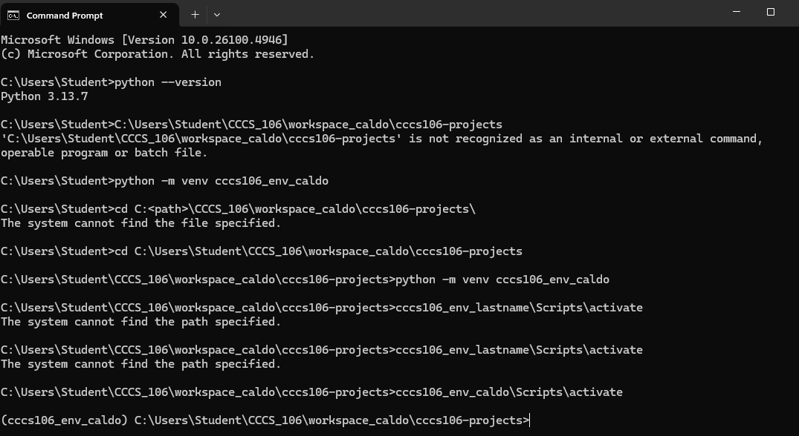
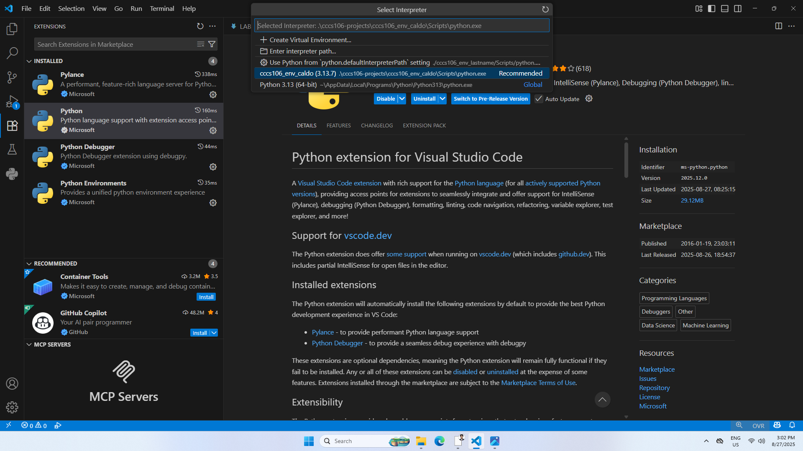

# Lab 1 Report: Environment Setup and Python Basics

**Student Name:** John Paul B. Caldo
**Student ID:** 231002310
**Section:** 3B
**Date:** 8/27/2025

## Environment Setup

### Python Installation
- **Python Version:**  3.13.7
- **Installation Issues:** None since it is already downloaded here and I am thankful for that
- **Virtual Environment Created:** ✅ cccs106_env_caldo

### VS Code Configuration
- **VS Code Version:**  1.103.2
- **Python Extension:** ✅ Installed and configured
- **Interpreter:** ✅ Set to cccs106_env_caldo/Scripts/python.exe

### Package Installation
- **flet** 0.28.3
- **Python:** 2025.12.0

## Programs Created

### 1. hello_world.py
- **Status:** ✅ Completed
- **Features:** Student info display, age calculation, system info
- **Notes:** None just change something chuchu

### 2. basic_calculator.py
- **Status:** ✅ Completed
- **Features:** Basic arithmetic, error handling, min/max calculation
- **Notes:** Also None and I am very thankful

## Challenges and Solutions

Actually everything is smooth and sound and there is no obstruction if you just focus and read the instructions carefully but I am still not confident if I did the task right but yeah that it

## Learning Outcomes

What i learn in this task is how important seperate environment or virtual environment if you have another file that is not working in newest version it wont be affected since you use virtual environment it just show how can dependencies are nice sometimes.

## Screenshots
- **Hello Word:**

- **Basic Calculator:**

- **Environment Setup:**

- **VS Code setup:**

